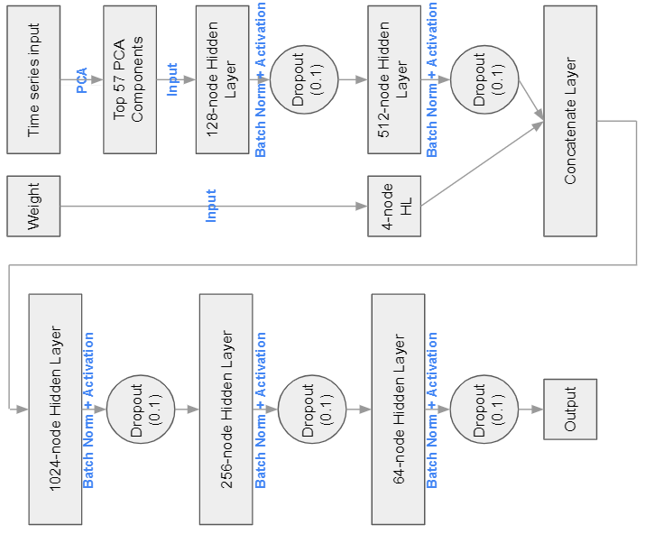
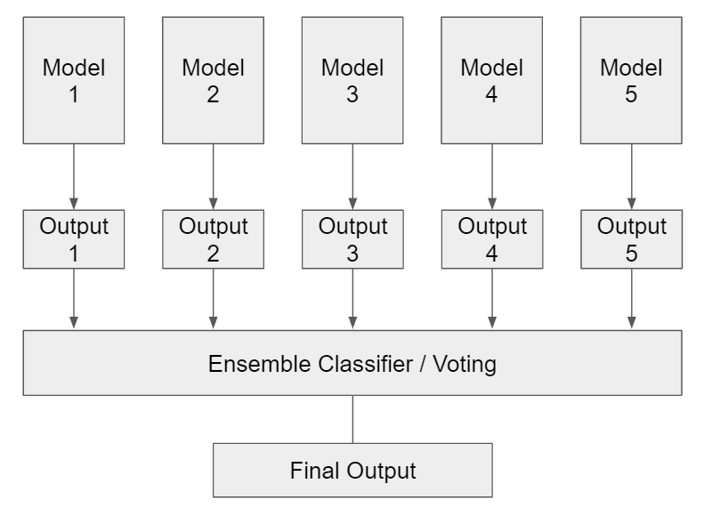

# Jane Street Market Prediction

Authors: Zeng Fung Liew, Hyeonji Choi, Jake Cheng

---

# Summary

Note: The dataset is obtained from a [Kaggle](https://www.kaggle.com/c/jane-street-market-prediction/overview) competition.

In this project, we approach this decision problem using various machine learning algorithms. Our results showed that traditional machine learning algorithms generally do not work well as compared to deep learning models, with our resulting average test accuracies being 57\% and 61\% respectively. Even then, the predictions made by deep learning models are still unsatisfactory. To further improve the prediction accuracies obtained by deep learning models, we constructed a stacking ensemble to fit secondary classifiers onto the outputs of our best deep learning models. This led to a significant improvement in prediction accuracies, with our best test accuracy being 66.7\%. 

The following are steps taken to achieve our goals:

1. Denoising and Feature Extraction:

    * Soft Thresholding using Discrete Wavelet Transforms (DWT)
    * Construction of Scaleograms using Continuous Wavelet Transforms (CWT)
    * Extraction of entropy, summary statistics, and zero-crossings rate using DWT
    * Principal Component Analysis (PCA)

2. Machine Learning models used:

   * Decision Trees
   * Random Forests
   * AdaBoost
   * Gradient Boosting Classifier
   * Logistic Regression
   * Naive-Bayes
   * Linear Discriminant Analysis (LDA)
   * Quadratic Discriminant Analysis (QDA)
   * k-Nearest Neighbors
   * Feed-forward Neural Network
   * Convolutional Neural Network

3. Stacking Ensembles:

    * Majority Voting
    * Average Voting
    * Traditional ML Classifiers

---
# Best Model Architecture

Our best model goes thru two levels of classification: 

1. Deep Learning
2. Stacking Ensemble

## Deep Learning Model Architecture
Our deep learning model architecture is shown as follows. Note that the time-series input goes through a data transformation stage via PCA.



## Stacking Ensemble 
The stacking ensemble architecture is shown as follows. Our best result for this level was obtained using the Gaussian Naive-Bayes classifier.



---

# Reproducing the Results
To reproduce our results, there are two main things to be done:

1. Download the dataset fram Kaggle.
2. Ensure that necessary folders exist.

## Downloading the Dataset
The dataset can either be downloaded directly from [Kaggle](https://www.kaggle.com/c/jane-street-market-prediction/data) or by connecting to the Kaggle API. For the latter method, follow the following steps:

1. **Install the Kaggle CLI** <br>
Open up terminal, type <br>
```
pip install kaggle
```

2. **Obtain Kaggle API credentials** <br>
To obtain authentication using an API token, go to Kaggle and click on "Create New API Token" under "Account" which can be accessed through the profile icon on the top right corner. Move the downloaded `kaggle.json` file to the location `~/.kaggle/kaggle.json` to use the API. For more information, go to this [link](https://www.kaggle.com/docs/api).

3. **Check if Kaggle API is working** <br>
Open up terminal once again, to ensure that the Kaggle API is currently working, type a command such as follows. This should return a list of Kaggle competitions.
```
kaggle competitions list
```

4. **Download the JaneStreet dataset** <br>
To download the dataset, do either of the following. The latter saves up more memory as only the necessary file for this project was downloaded.
```
# downloads entire dataset
kaggle competitions download -c jane-street-market-prediction  
# only downloads `train.csv`
kaggle competitions download -f train.csv jane-street-market-prediction
```
The dataset is now downloaded.

## Ensuring that necessary folders exist
In this project, we built and saved models and results in Python. To ensure that the trained model is stored correctly, please have the following folders created prior to running any code in this repo.

* `dataset/`
* `models/`
* `results/`

Since we ignored rows of data with `NaN` values or zero weight, some form of data cleaning was performed prior to the start of building any models. Hence, ensure that `src/data_cleaning.py` is first ran and its resulting outputs are stored in `dataset/` as `input_data.csv` and `output_data.csv` respectively.